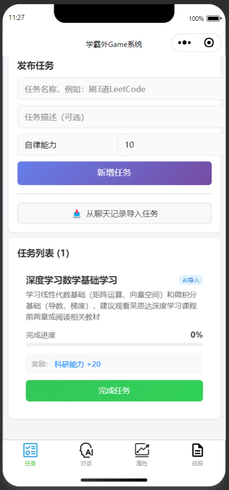
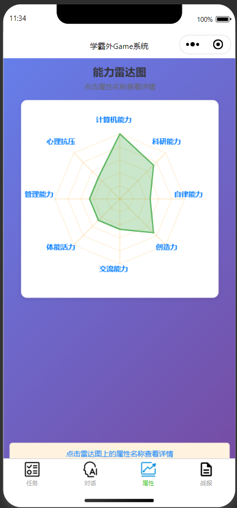
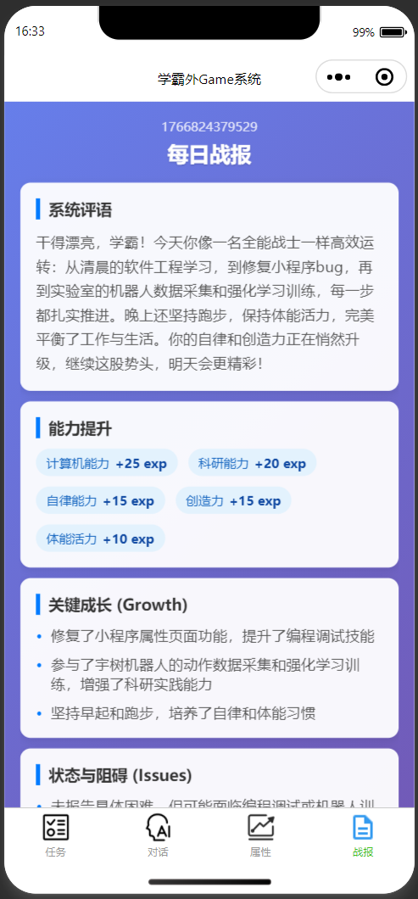
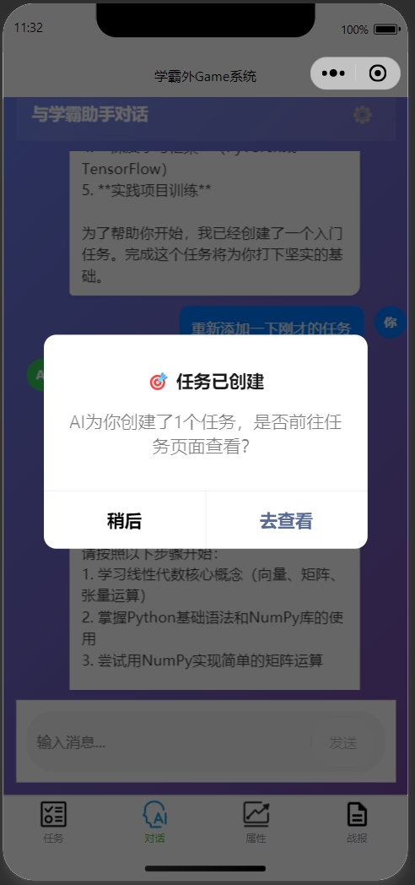
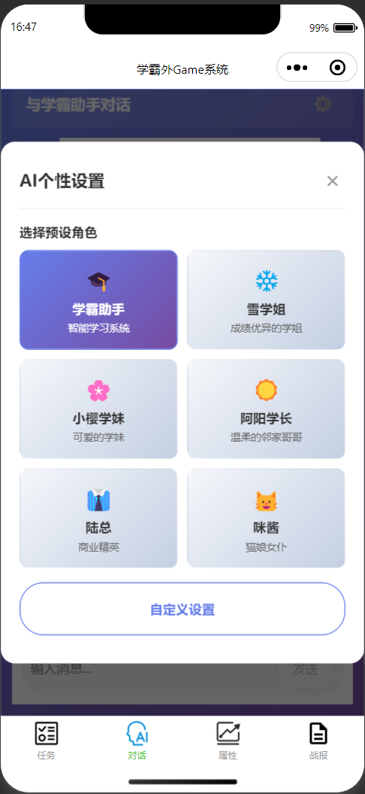

# 🎓 学霸外Game系统 (Scholar Game System)

> 将学习成长游戏化的智能助手系统，让变强像玩游戏一样上瘾！

## 🌟 项目概述

"学霸外Game系统"是一个结合了**游戏化成长体系**和**大模型Agent**的微信小程序。它通过将个人的成长量化为八项核心能力，配合智能AI助手，帮助用户制定计划、追踪进度、生成战报，让自我提升的过程充满乐趣和成就感。

## 🖼️ 界面预览 (Product Preview)

<table style="width: 100%; border-collapse: collapse;">
  <tr>
    <td align="center" style="width: 33%; border: none;">
      <b>任务管理</b><br/>
      
    </td>
    <td align="center" style="width: 33%; border: none;">
      <b>属性雷达</b><br/>
      
    </td>
    <td align="center" style="width: 33%; border: none;">
      <b>每日战报</b><br/>
      
    </td>
  </tr>
</table>

## ✨ 核心功能

### 1. 🎮 游戏化成长体系
- **八大核心能力**：计算机能力、科研能力、自律能力、创造力、交流能力、体能活力、管理能力、心理抗压。
- **经验值与等级**：完成任务获得经验值，提升能力等级。
- **属性雷达图**：在"属性"页面通过雷达图直观展示个人能力分布。
  <br/>

### 2. 🤖 智能Agent助手
- **上下文感知**：AI实时了解你的属性状态 and 任务进度。
- **主动任务识别**：当你告诉AI"我想学Python"时，它会识别并建议具体的学习任务（需手动创建）。
- **结构化输出**：AI生成的任务以结构化形式输出，方便用户查看与手动创建。
  <br/>

### 3. 🎭 AI个性化设定 (New!)
- **多重人格**：内置6种预设角色，支持完全自定义AI的名字、性格、语言风格和角色身份。
- **持久化存储**：你的AI设定会自动保存，随时陪伴。
  <br/>

### 4. 📊 每日战报系统 (New!)
- **智能生成**：AI根据你一天的聊天和工作内容，自动生成结构化的每日战报。
- **能力评估**：自动分析你的成长点（Growth）、遇到的困难（Issues）和成就（Achievements）。
- **属性奖励**：根据战报内容，AI会自动给予相应的属性经验值奖励。
  <br/>

### 5. 📝 任务管理系统
- **任务看板**：清晰展示待办任务和已完成任务。
- **自动导入**：AI对话中生成的任务一键导入。
- **进度追踪**：记录任务完成度，获得成就感。
  <br/>

---

## 🛠️ 技术架构

- **前端**：微信小程序 (Native)
- **后端**：Node.js + Express
- **AI服务**：集成 Deepseek / OpenAI API
- **数据存储**：本地存储 (Storage) + 内存数据

## 🚀 快速开始

### 1. 启动后端服务
```bash
cd server
npm install
# 配置 .env 文件中的 API Key
node index.js
```

### 2. 运行小程序
1. 打开微信开发者工具
2. 导入 `miniprogram` 目录
3. 确保详情设置中勾选 "不校验合法域名" (开发环境)

## 📖 使用指南

### 与AI对话
- 进入"对话"页面，像聊天一样告诉AI你的计划。
- 点击右上角 ⚙️ 图标可以切换AI的性格。

### 生成战报
- 点击对话页面的"生成战报"按钮，或在"战报"页面输入今日总结。
- AI会分析你的表现并给予奖励。

### 查看属性
- 进入"属性"页面，查看你的能力雷达图和详细等级。

---

## 📝 更新日志

- **v1.2.0** - 新增AI个性化设定、每日战报系统
- **v1.1.0** - 引入Agent系统提示词
- **v1.0.0** - 基础任务系统、属性系统上线

---

**Start your game of life now!** 🚀

